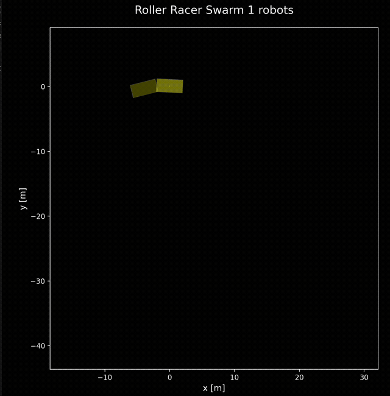
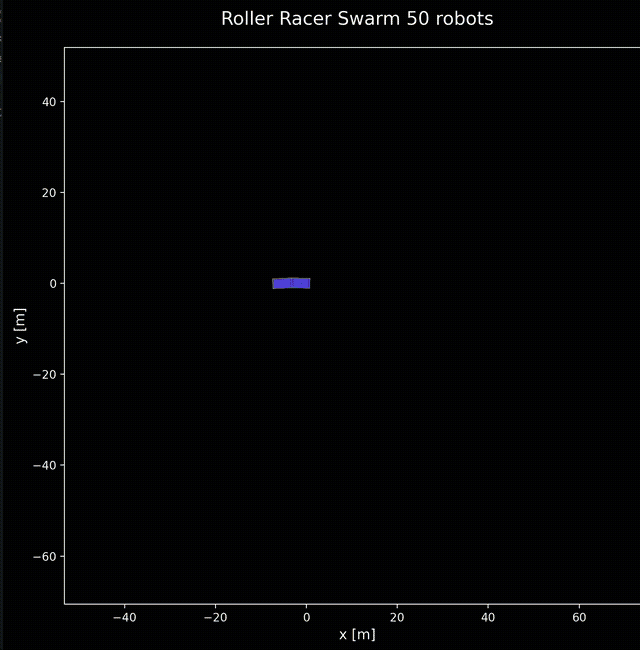
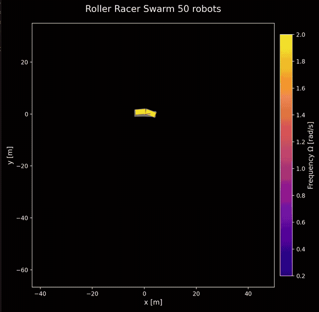
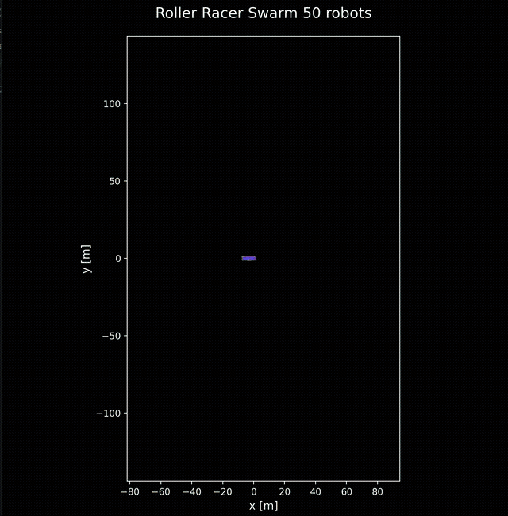
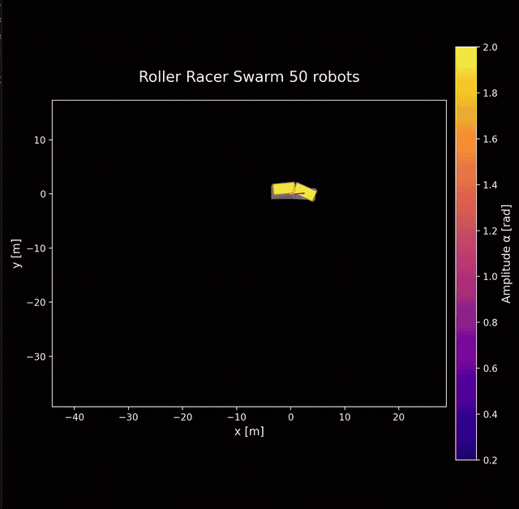
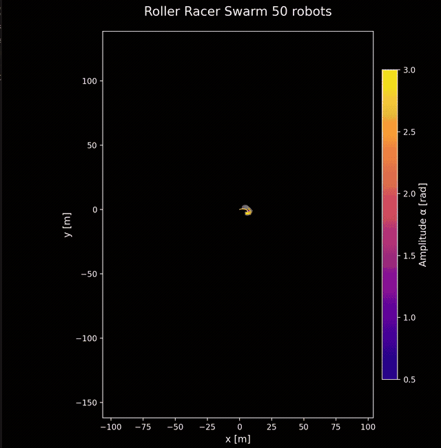

# Roller Racer Simulation


## Overview


This repository contains python simulation and visualization of "Roller Racers", a nonholonomic system with two rigid bodies connected by an actuated revolute joint. Each body has wheels on a single fixed axis allowing it to only roll in one direction, creating the nonholonomic constraints. It's also like a 2 link snake robot. See the paper 

## Simulations

### Single Robot



### Swarms
The system is a bit chaotic and variations in parameters create really interesting swarm trajectories:









## Usage

```bash
python roller_racer_sim.py
```

The simulation supports both single robot and swarm configurations. Parameter variations can be explored by modifying the `Params` class or using the multi-robot animation function.

## Disclaimer
This is a quick and fun prototype and most of this code is generated by LLMs. Dynamics seem to match the paper but are not verified.