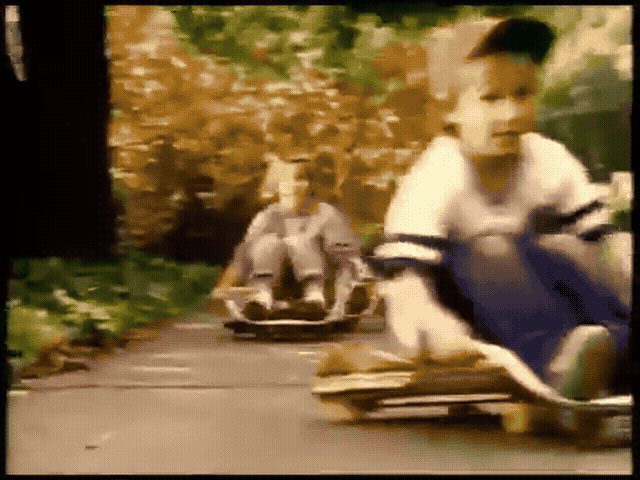
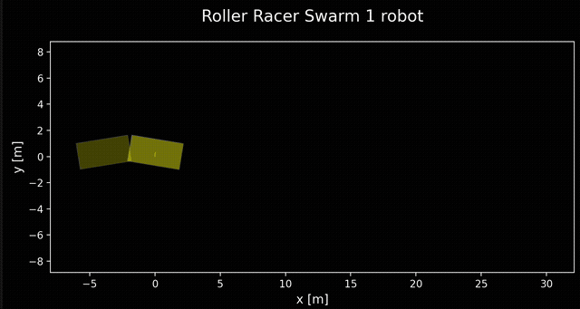
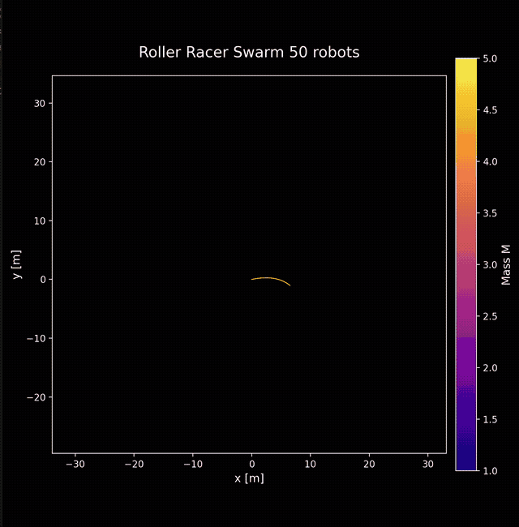

This repository contains python simulation and visualization of "Roller Racers", an old kids toy that allows you to skate by turning your arms back and forth. It's also an interesting nonholonomic dynamics system with two rigid bodies connected by an actuated revolute joint. Each body has passive wheels on a single fixed axis allowing it to only roll in one direction, creating the nonholonomic constraints. Kind of like a 2 link snake robot. Equations of motion come from the paper [Exotic Dynamics of Nonholonomic Roller Racer with Periodic Control](https://github.com/qwertpas/rollerracer/blob/5455f29f771e633fa4af59d916ceac52251127f4/resources/Exotic%20Dynamics%20of%20Nonholonomic%20Roller%20Racer.pdf).

## Simulations

### Single Robot



### Swarms
The system is a bit chaotic and variations in parameters create really interesting swarm trajectories:





## Usage

```bash
python roller_racer_sim.py
```

The simulation supports both single robot and swarm configurations. Parameter variations can be explored by modifying the `Params` class or using the multi-robot animation function.

## Disclaimer
This is a quick and fun prototype and most of this code is generated by LLMs. Dynamics seem to match the paper but are not verified.